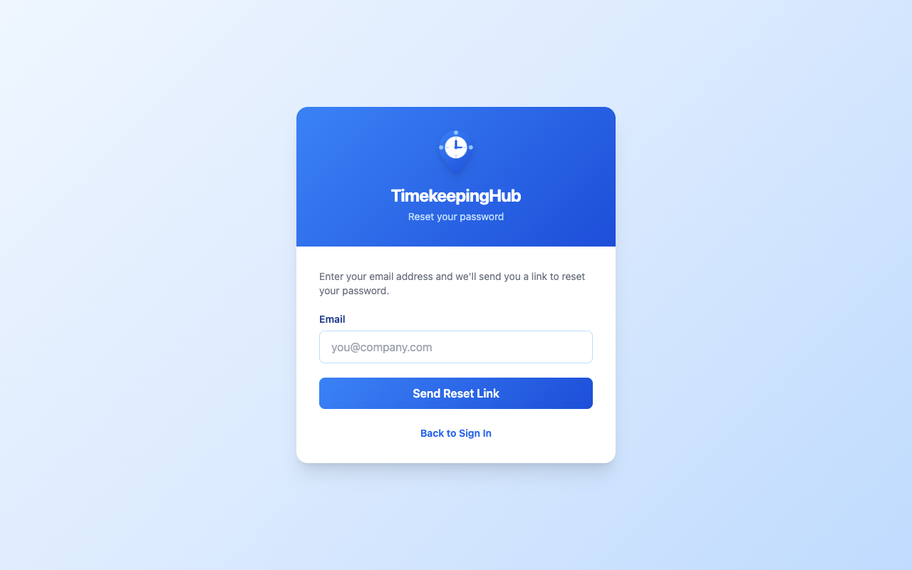
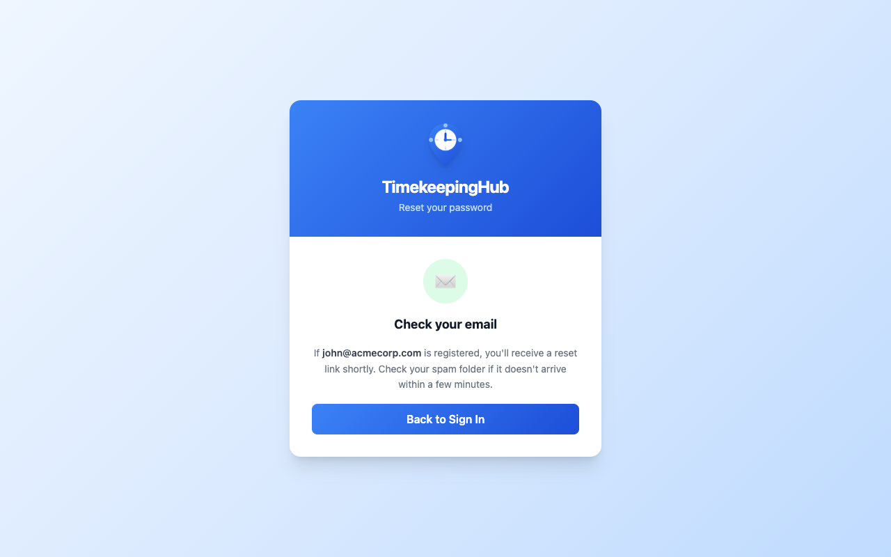
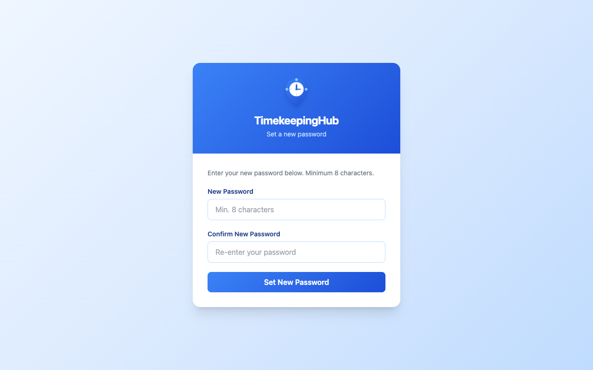
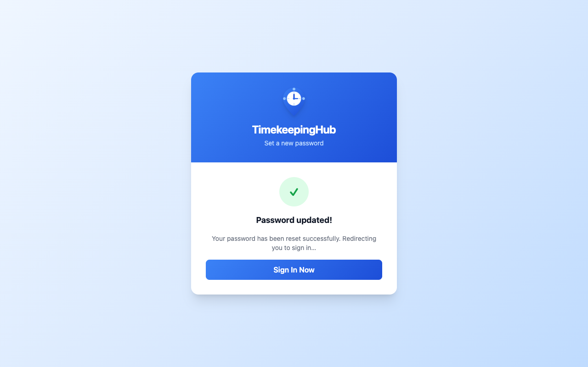

# TimekeepingHub — Employee User Guide

**App URL:** https://timekeepinghub.com

---

## 1. Creating Your Account

Your company admin will give you a **Company Code** — a short identifier unique to your organisation (e.g. `fourhub-technologies`).

Once you have the code:

1. Go to **https://timekeepinghub.com/#/register**
2. Fill in:
   - **Your Full Name**
   - **Email** — your work email address
   - **Password** — choose a strong password
   - **Company Code** — the code your admin gave you
3. Click **Create Employee Account**
4. You will be logged in automatically and taken to your dashboard

> Ask your company admin for the Company Code before filling in the registration form. If you enter the wrong code you will see a "Company code not found" error.

---

## 2. Signing In

1. Go to https://timekeepinghub.com/#/login
2. Enter your **Email** and **Password**
3. Click **Sign In**

You will be taken to your Weekly Timesheet dashboard.

---

## 3. Forgot or Reset Your Password

If you have forgotten your password, you can reset it by email.

### Requesting a Reset Link

1. On the login page, click **Forgot your password?**
2. Enter the **email address** you registered with
3. Click **Send Reset Link**
4. A confirmation screen will appear — a reset link has been sent to your inbox

> For security, the confirmation screen is shown regardless of whether the email address is registered. If no email arrives within a few minutes, check your spam folder and confirm you used the right address.

### Setting a New Password

1. Open the email from TimekeepingHub and click the **Reset my password** link
2. You will be taken to the **Set a new password** page
3. Enter your new password (minimum 8 characters)
4. Re-enter it in the **Confirm New Password** field
5. Click **Set New Password**
6. A success message will appear and you will be automatically redirected to the sign-in page after 3 seconds

> Reset links expire after **1 hour** and can only be used once. If your link has expired, simply request a new one from the login page.

---

## 4. Logging Your Hours

### Your Dashboard

After signing in you will see the **Weekly Timesheet** screen. It shows the current week with 7 day cards (Mon–Sun) across the top.

- **Today** is highlighted in blue
- **Weekend days** (Sat, Sun) have a grey background
- Each day shows a clock dial that fills up as you log hours

### Adding Hours for a Day

1. Click on any day card
2. A time entry panel will open
3. Set your **Start time** (e.g. 09:00)
4. Set your **End time** (e.g. 17:00)
5. Select your **Break time** — choose from:
   - No break
   - 15 min
   - 30 min
   - 1 hr
   - **Custom** — click the Custom pill and type any number of minutes (e.g. 45, 90)
6. Optionally add a **Note** (e.g. "Client meeting", "WFH")
7. The **Net worked** time is calculated automatically
8. Click **Save**

The day card will update immediately to show your clock-in and clock-out times.

### Editing or Deleting an Entry

- Click on a day that already has an entry
- Change the times or break and click **Update**
- To remove the entry, click **Delete**

### Navigating Weeks

- Use **‹ Prev** and **Next ›** buttons to move between weeks
- Click **Back to this week** to return to the current week
- You can log time for the **current week and the previous week**
- Going further back is locked — contact your admin if you need to edit older entries

---

## 5. Submitting Your Timesheet

At the end of each week, you must submit your timesheet:

1. Make sure you have logged hours for all your working days
2. The bottom of the screen shows how many days are logged this week
3. Click **Submit Week →**
4. A green confirmation message will appear with your total days and net hours worked
5. The button will change to a **✓ Submitted** badge — you cannot submit again for that week

> Submit your timesheet every week. Once submitted it cannot be changed.

---

## 6. Weekly Summary

At the bottom of the dashboard you will see three summary cards:

| Card | What it means |
|---|---|
| **Total logged** | Total time from clock-in to clock-out across all days |
| **Break time** | Total break time deducted |
| **Net worked** | Your actual worked hours (Total − Break) |

---

## 7. Signing Out

Click your name or role badge in the top-right corner area, then click **Sign out**.

---

## 8. Need Help?

Contact your company admin if you:
- Cannot log in
- Need to edit a locked week
- Were not given your login credentials
