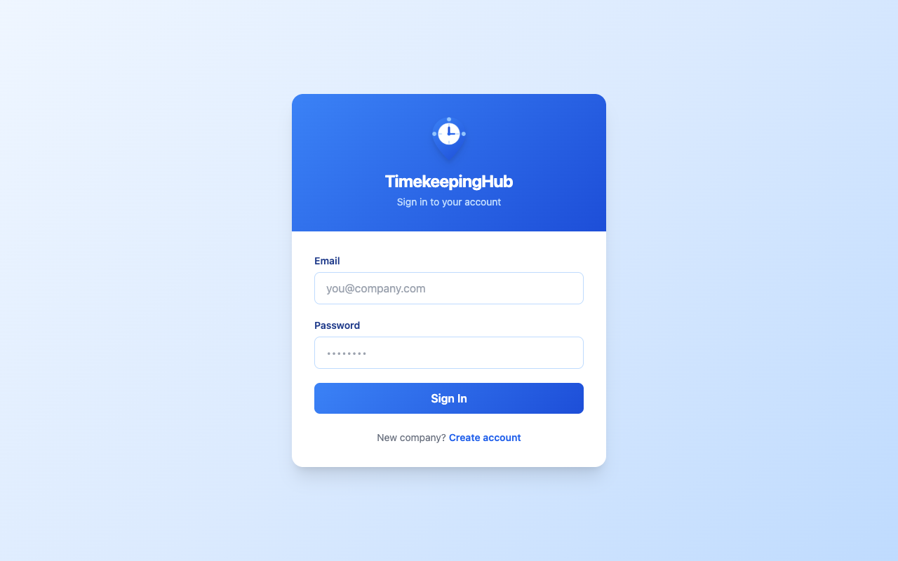
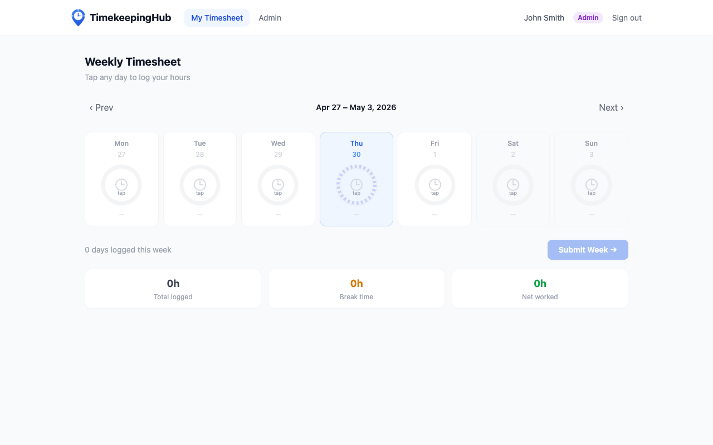
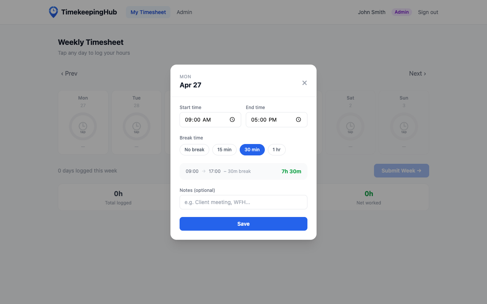

# TimekeepingHub — Employee User Guide

**App URL:** https://timekeepinghub.com

---

## 1. Getting Access

Your company admin creates your account and gives you two things:

- Your **email address** (used to log in)
- Your **password**

Once you have those, go to **https://timekeepinghub.com/#/login** to sign in. You do not need to register — your admin handles that.

> If you haven't received your login details, contact your company admin.

---

## 2. Signing In

1. Go to https://timekeepinghub.com/#/login
2. Enter your **Email** and **Password**
3. Click **Sign In**

You will be taken to your Weekly Timesheet dashboard.

---

## 3. Logging Your Hours

### Your Dashboard

After signing in you will see the **Weekly Timesheet** screen. It shows the current week with 7 day cards (Mon–Sun) across the top.

- **Today** is highlighted in blue
- **Weekend days** (Sat, Sun) have a grey background
- Each day shows a clock dial that fills up as you log hours

### Adding Hours for a Day

1. Click on any day card
2. A time entry panel will open
3. Set your **Start time** (e.g. 09:00)
4. Set your **End time** (e.g. 17:00)
5. Select your **Break time** — choose from:
   - No break
   - 15 min
   - 30 min
   - 1 hr
6. Optionally add a **Note** (e.g. "Client meeting", "WFH")
7. The **Net worked** time is calculated automatically
8. Click **Save**

The day card will update immediately to show your clock-in and clock-out times.

### Editing or Deleting an Entry

- Click on a day that already has an entry
- Change the times or break and click **Update**
- To remove the entry, click **Delete**

### Navigating Weeks

- Use **‹ Prev** and **Next ›** buttons to move between weeks
- Click **Back to this week** to return to the current week
- You can log time for the **current week and the previous week**
- Going further back is locked — contact your admin if you need to edit older entries

---

## 4. Submitting Your Timesheet

At the end of each week, you must submit your timesheet:

1. Make sure you have logged hours for all your working days
2. The bottom of the screen shows how many days are logged this week
3. Click **Submit Week →**
4. A green confirmation message will appear with your total days and net hours worked
5. The button will change to a **✓ Submitted** badge — you cannot submit again for that week

> Submit your timesheet every week. Once submitted it cannot be changed.

---

## 5. Weekly Summary

At the bottom of the dashboard you will see three summary cards:

| Card | What it means |
|---|---|
| **Total logged** | Total time from clock-in to clock-out across all days |
| **Break time** | Total break time deducted |
| **Net worked** | Your actual worked hours (Total − Break) |

---

## 6. Signing Out

Click your name or role badge in the top-right corner area, then click **Sign out**.

---

## 7. Need Help?

Contact your company admin if you:
- Cannot log in
- Need to edit a locked week
- Were not given your login credentials
